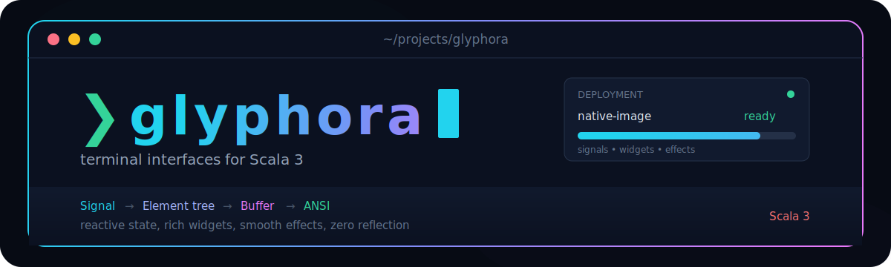
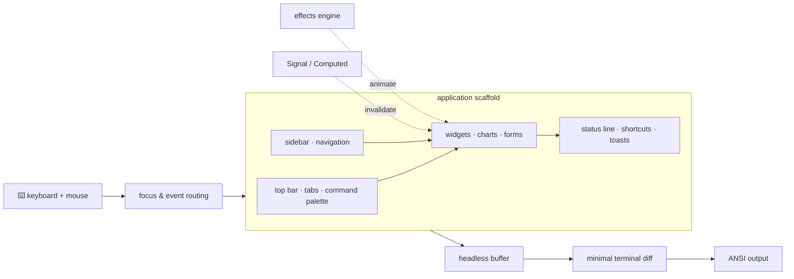
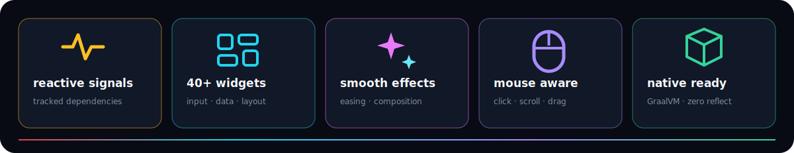
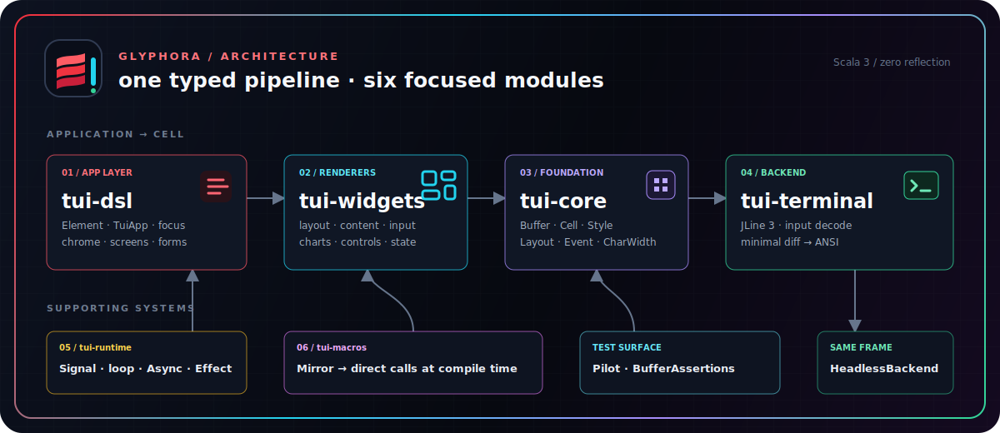

<div align="center">



**Build expressive terminal UIs in Scala 3** — a signals-driven widget toolkit with app chrome,
animations, mouse support, and first-class GraalVM native-image binaries.

[](https://github.com/oleksandr-balyshyn/glyphora/actions/workflows/ci.yml)
[](https://oleksandr-balyshyn.github.io/glyphora/)
[](https://github.com/oleksandr-balyshyn/glyphora/tags)
[](https://scala-lang.org)
[](https://mill-build.org)
[](https://www.graalvm.org/latest/reference-manual/native-image/)
[](#-architecture)
[](LICENSE)



The showcase combines app chrome, reactive widgets, input routing, and effects in one
terminal-native render pipeline. See [`examples/showcase`](examples/showcase/) and
[headless testing](#-test-your-app-headlessly).

**📖 [oleksandr-balyshyn.github.io/glyphora](https://oleksandr-balyshyn.github.io/glyphora/)** — the full guide, cookbook, and per-module API reference.

</div>

---

## ✨ Why glyphora

<p align="center"></p>

- 🧠 **Signals, not spaghetti** — state lives in `Signal`/`Computed`; whatever your view *reads*, re-renders when it changes. No dispatch loops, no dependency arrays.
- 🧱 **40+ widgets** — from `Block` and `Gauge` to `DataTable`, `TextArea` (undo, cluster-safe editing), `DirectoryTree`, `Markdown`, braille `Chart`s, and a half-block `Image`.
- 🏛️ **App chrome built in** — `scaffold` with top bar / sidebar / status line, themes, key-binding registry, screens, toasts, and a fuzzy `Ctrl+P` command palette.
- 🎬 **Motion** — a post-render effects engine (`fadeIn`, `coalesce`, `typewriter`, …) with easing and combinators, plus skippable splash screens.
- 🖱️ **Mouse-aware** — click to focus/activate, wheel to scroll, drag sliders and split panes.
- 🌍 **Unicode-correct** — display width from the Unicode Character Database: CJK, emoji ZWJ families, flags, combining marks all measure right.
- 📦 **Native binaries** — every example compiles with `native-image --no-fallback` and **zero reflect-config**, starting in milliseconds.
- 🧪 **Testable by design** — a headless backend + `Pilot` driver run full event/render cycles in plain unit tests.

## 🚀 Quick start

```scala
// build.mill
def mvnDeps = Seq(mvn"io.worxbend::tui-dsl:0.9.0")
```

```scala
import io.worxbend.tui.dsl.*

object Hello extends TuiApp:
  val count = Signal(0)

  override def bindings = KeyBindings(
    binding("+", "increment")(count.update(_ + 1)),
    binding("q", "quit")(quit()),
  )

  def view(using ReactiveScope): Element =
    scaffold(statusBar = Some(statusBar(bindings))) {
      centered(30, 5) {
        panel("Hello")(
          text(s"count: ${count.get}").bold.color(Color.Cyan),
          text("press + to bump it").dim,
        ).rounded
      }
    }

  def main(args: Array[String]): Unit = run().foreach(_ => ())
```

One import gives you every factory, the styling/layout extensions, and the core vocabulary.
More recipes in the **[📖 cookbook](docs/COOKBOOK.md)**; complete apps in **[`examples/`](examples/README.md)**;
the full guide and API reference are on the **[docs site](https://oleksandr-balyshyn.github.io/glyphora/)**.

## 🧩 Widget catalog

| | |
|---|---|
| 🧱 **Layout & chrome** | `Block` (per-side borders, padding), `Row`/`Column` (`Flex` packing, margins), `place`/`Align`, `Spacer`, `Rule`, `Scrollbar`, `ScrollView`, `TabbedContent`, `Collapsible`, `SplitPane`, `Menu` (dropdown / context), `layers` |
| 📄 **Content** | `Paragraph` (cluster-safe wrap), `ListView`, `Table`, `Tabs`, `BigText`, `Log` (follow-tail), `Markdown` (syntax-highlighted fences), `Link` (OSC 8), `Image` (half-block) |
| ⌨️ **Input** | `TextInput`, `TextArea` (undo), `Checkbox`, `Toggle`, `Select`, `RadioGroup`, `Slider`, `NumberInput`, `MaskedInput`, `SelectionList`, `Autocomplete`, `FilePicker`, `Button`, `Form` (compile-time derived, accessible mode) |
| 📊 **Data viz** | `Gauge`, `LineGauge`, `Sparkline`, `DualSparkline`, `BarChart`, `StackedBarChart`, `Chart` (braille/half-block), `PieChart`, `Heatmap`, `Canvas` + shapes, `Calendar`, `DataTable` (sort/filter) |
| ⏳ **Motion & feedback** | `Spinner`, `Skeleton`, `IndeterminateBar`, `Marquee`, `WaveText`, `Tooltip`, `Dialog`, toasts, splash screens, `Stopwatch`/`Timer`, the `Effect` engine (full easing set + `Spring` physics) |

## 🏗️ Architecture

<p align="center"></p>

| Module | What it owns |
|---|---|
| [`core/`](core/README.md) | `Buffer`/`Cell`, `Style`, `Layout` solver, `Widget` traits, event ADT, `CharWidth` (UCD-generated width table) |
| [`terminal/`](terminal/README.md) | `Backend` trait, JLine 3 impl (diff flush, input decoding), `HeadlessBackend` |
| [`widgets/`](widgets/README.md) | every built-in widget — backend-agnostic, render-to-`Buffer` tested |
| [`runtime/`](runtime/README.md) | `Signal`/`Computed`, render thread, runner loop, `Effect` engine |
| [`dsl/`](dsl/README.md) | `TuiApp`, `Element` tree, focus/mouse routing, chrome presets, screens/toasts/palette |
| [`macros/`](macros/README.md) | `deriveForm`/`bindAction` — compile-time only, keeps native-image reflect-config-free |
| [`test-support/`](test-support/README.md) | `Pilot` driver + buffer assertions |

Per-module Scaladoc for every published module is on the [docs site's API reference](https://oleksandr-balyshyn.github.io/glyphora/api/).

**House rules** (CI-enforced): no `java.lang.reflect`/`Class.forName` anywhere; no
`String.length`/`substring` for layout math outside `CharWidth`; warnings are errors;
scalafmt owns formatting.

## 🧪 Test your app headlessly

```scala
val backend = HeadlessBackend(Size(60, 16))
val pilot   = Pilot.start(backend) { app.runWith(backend) }

pilot.typeText("deploy").pressKey(KeyCode.Enter).waitForIdle()
assert(pilot.screenText.contains("deployed ✓"))
```

Full event/render cycles, no PTY, CI-friendly. All 1,500+ tests in this repo run this way.

## ⚡ Native binaries

```bash
./mill show examples.showcase.nativeImage   # → a self-contained executable
```

Every example builds with `--no-fallback` and **no reflect-config JSON** — the
framework bridges user code with Scala 3 `inline`/`Mirror` instead of reflection.

## 🛠️ Developing glyphora

```bash
./mill __.compile                                   # build everything
./mill __.test                                      # ~1.5k tests, headless
./mill mill.scalalib.scalafmt.ScalafmtModule/reformatAll __.sources
./mill widgets.test.runMain io.worxbend.tui.widgets.RenderLoopBench      # fps check
./mill examples.showcase.test.runMain \
      io.worxbend.tui.examples.showcase.ScreenshotMain 70 17             # README shot
./mill examples.showcase.run                        # drive it for real
```

**Adding a widget** — the checklist that keeps quality flat:
1. Implement against `Widget`/`StatefulWidget[S]` in `widgets/` (state is caller-owned; all width math through `CharWidth`).
2. Render-to-`Buffer` tests via `BufferAssertions.rendered`.
3. DSL factory in `dsl/Element.scala` + export in `dsl.scala` (focusable elements get a `builtinKeyHandler`, mouse behavior via `builtinMouseHandler`).
4. If interactive: an end-to-end `Pilot` test.

## 🔖 Versioning

Pre-1.0: minor versions (`0.x`) may break APIs, patches never do. `tui-core` is the
stability anchor — additive changes only since 0.2. Releases are git tags (`vX.Y.Z`);
pushing a tag publishes all modules to Maven Central via the `Publish` workflow
(binary-compatibility gates via MiMa arrive with the first Central release as baseline).

## 📜 License

[MIT](LICENSE) — go build something glyphorious. ✨
