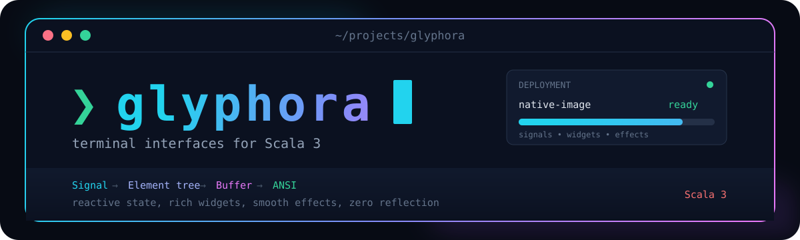
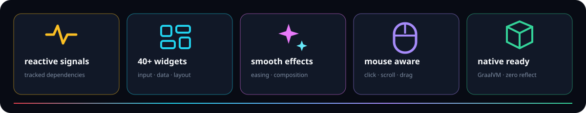
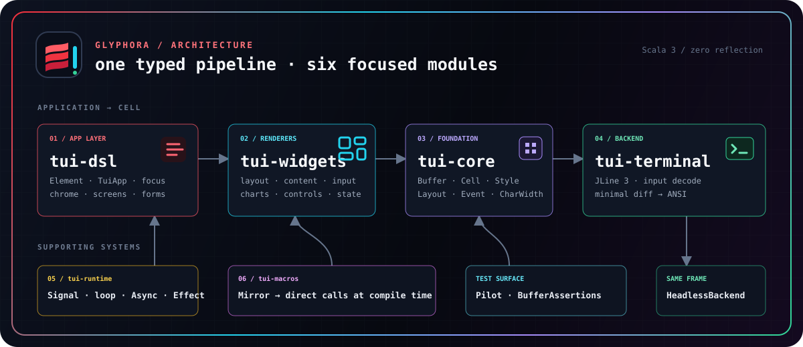
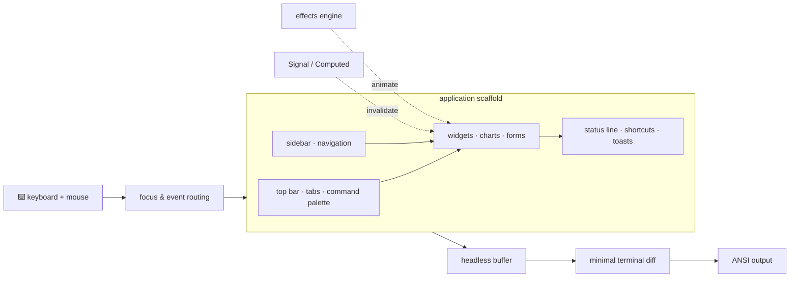

<div align="center">



<h3>✦ Terminal UI, written like Scala.</h3>

<p>
  <strong>Reactive signals</strong> · <strong>40+ widgets</strong> · <strong>keyboard &amp; mouse</strong><br/>
  <strong>composable motion</strong> · <strong>headless tests</strong> · <strong>GraalVM native-image</strong>
</p>

<p>
  <a href="https://github.com/oleksandr-balyshyn/glyphora/actions/workflows/ci.yml"></a>
  <a href="https://oleksandr-balyshyn.github.io/glyphora/"></a>
  <a href="https://github.com/oleksandr-balyshyn/glyphora/tags"></a>
  <a href="LICENSE"></a>
</p>

<p>
  
  
  
  
  
</p>

<p>
  <a href="https://oleksandr-balyshyn.github.io/glyphora/"><b>📖 Read the guide</b></a> ·
  <a href="https://github.com/oleksandr-balyshyn/glyphora/wiki"><b>📚 Browse the wiki</b></a> ·
  <a href="website/docs/cookbook.md"><b>🍳 Cookbook</b></a> ·
  <a href="https://oleksandr-balyshyn.github.io/glyphora/api/"><b>🔎 Scaladoc</b></a> ·
  <a href="examples/README.md"><b>🎮 Examples</b></a>
</p>

</div>

---

## ✦ Why glyphora

<p align="center"></p>

<table>
<tr>
<td width="25%" align="center" valign="top">
  <br/>
  <b>⚡ Signals, not plumbing</b><br/>
  <sub>Read <code>Signal</code> and <code>Computed</code> in a typed Scala view; glyphora tracks the dependencies and redraws what changed.</sub>
</td>
<td width="25%" align="center" valign="top">
  <br/>
  <b>🧩 A real widget vocabulary</b><br/>
  <sub>Inputs, tables, trees, Markdown, charts, dialogs, menus and app chrome all ship together.</sub>
</td>
<td width="25%" align="center" valign="top">
  <br/>
  <b>⌨️ Interaction is first-class</b><br/>
  <sub>Focus order, bubbling keys, bracketed paste, mouse hit-testing and resize events are built in.</sub>
</td>
<td width="25%" align="center" valign="top">
  <br/>
  <b>🎬 Motion stays composable</b><br/>
  <sub>Effects transform the completed frame, so widget renderers stay deterministic and testable.</sub>
</td>
</tr>
<tr>
<td align="center" valign="top">
  <br/>
  <b>🧪 Tests share one pipeline</b><br/>
  <sub>Render to a real terminal or the in-memory <code>HeadlessBackend</code> — drive whole apps with no PTY.</sub>
</td>
<td align="center" valign="top">
  <br/>
  <b>📦 Native-image by design</b><br/>
  <sub>Compile-time derivation replaces runtime reflection, so examples build with <code>--no-fallback</code> and no reflect config.</sub>
</td>
<td align="center" valign="top">
  <br/>
  <b>🌍 Unicode done properly</b><br/>
  <sub>Grapheme clusters, CJK width, emoji ZWJ sequences and combining marks all go through one width table.</sub>
</td>
<td align="center" valign="top">
  <br/>
  <b>🏗️ Batteries-included shell</b><br/>
  <sub>Scaffold, top bar, sidebar, status line, toasts, screens and a fuzzy command palette.</sub>
</td>
</tr>
</table>

## 🚀 Your first app

> [!NOTE]
> **Not on Maven Central yet.** `v0.10.0` is tagged but unreleased, so the coordinates below
> will not resolve. Until the first release lands, use `./mill __.publishLocal` and depend on
> `0.10.0` from your local Ivy cache — see [Build from source](#-build-from-source).

```scala
// build.mill
def mvnDeps = Seq(mvn"io.worxbend::tui-dsl:0.10.0")
```

```scala
// build.sbt
libraryDependencies += "io.worxbend" %% "tui-dsl" % "0.10.0"
```

Then return an ordinary Scala `Element` tree:

```scala
import io.worxbend.tui.dsl.*

object Counter extends TuiApp:
  private val count = Signal(0)

  override def bindings: KeyBindings = KeyBindings(
    binding("+", "increment")(count.update(_ + 1)),
    binding("-", "decrement")(count.update(_ - 1)),
    binding("q", "quit")(quit()),
  )

  def view(using ReactiveScope): Element =
    scaffold(statusBar = Some(statusBar(bindings))) {
      centered(34, 7) {
        panel("Counter")(
          text(s"Count: ${count.get}").bold.color(Color.Cyan),
          spacer,
          text("Change state; the view follows.").dim,
        ).rounded
      }
    }

  def main(args: Array[String]): Unit =
    run().left.foreach(error => println(s"failed to run: $error"))
```

Three ideas carry through the entire toolkit:

| | |
|---|---|
| 1️⃣ **Model** | changing values with `Signal`; derive cached values with `Computed` |
| 2️⃣ **Compose** | the screen from elements, constraints, semantic styles, and retained widget state |
| 3️⃣ **Ship** | on the JVM, test through `HeadlessBackend`, or compile a native binary |

📘 The guided walkthrough explains every line: **[Getting started →](website/docs/getting-started.md)**

## 🧭 One render pipeline

<p align="center"></p>

| Module | Owns |
|---|---|
| 🧱 [`tui-core`](core/README.md) | cells, buffer, geometry, style, layout, events, Unicode display width |
| 🖥️ [`tui-terminal`](terminal/README.md) | backend contract, JLine 3, ANSI diffing, input decoder, headless backend |
| 🧩 [`tui-widgets`](widgets/README.md) | backend-independent content, controls, data, visualization, and feedback widgets |
| ⚡ [`tui-runtime`](runtime/README.md) | signals, render thread, loop, async work, timers, easing, effects |
| 🎨 [`tui-dsl`](dsl/README.md) | element tree, `TuiApp`, focus/mouse routing, themes, shell, screens, toasts, palette |
| 🪄 [`tui-macros`](macros/README.md) | reflection-free form and action derivation at compile time |

Use the complete `tui-dsl` stack for applications, or stop at a lower layer for a custom
backend, renderer, or widget library. **No widget depends on a terminal and no terminal
backend knows about signals.**

The modules above are the structure; this is what one frame actually does:


```mermaid
flowchart LR
  Input["⌨️ keyboard + mouse"] --> Router["focus & event routing"]
  Router --> Chrome

  subgraph Chrome["application scaffold"]
    direction TB
    Top["top bar · tabs · command palette"]
    Sidebar["sidebar · navigation"]
    Content["widgets · charts · forms"]
    Status["status line · shortcuts · toasts"]
    Top --> Content
    Sidebar --> Content
    Content --> Status
  end

  Chrome --> Buffer["headless buffer"]
  Buffer --> Diff["minimal terminal diff"]
  Diff --> ANSI["ANSI output"]

  Signals["Signal / Computed"] -. "invalidate" .-> Content
  Effects["effects engine"] -. "animate" .-> Content
```

Only the cells that changed reach the terminal, and the whole path up to `ANSI output` runs
without one — which is what makes [headless testing](#-test-the-terminal-without-a-terminal)
exact rather than approximate.

🧭 **[Architecture guide →](website/docs/architecture.md)**

## 🧩 Widget atlas

| Family | Highlights |
|---|---|
| 🧱 **Layout & chrome** | panel, row/column, spacer, rule, scroll view, tabs, collapsible, split pane, layers, scaffold, sidebar |
| 📄 **Content** | text, list, table, `DataTable`, tree, directory tree, log, Markdown, OSC 8 links, half-block image |
| ⌨️ **Input** | text input/area, checkbox, toggle, select, radio group, slider, masked/number input, autocomplete, file picker, button, derived form |
| 📊 **Data viz** | gauge, sparkline, bar/stacked/pie chart, line/scatter chart, heatmap, canvas shapes, calendar |
| ✨ **Feedback** | spinner, skeleton, indeterminate bar, marquee, wave text, dialog, tooltip, toasts, splash, effects |

Every interactive state object is caller-owned. Every widget renders into a `Buffer`. Every
width calculation goes through grapheme-aware `CharWidth`.

🧩 **[Browse the complete catalog →](website/docs/widgets.md)**

## 🧪 Test the terminal without a terminal

```scala
val backend = HeadlessBackend(Size(50, 10))
val app = TodoApp()
val pilot = Pilot.start(backend) {
  val _ = app.runWith(backend)
}

pilot
  .waitForIdle()
  .typeText("ship docs")
  .pressKey(KeyCode.Enter)
  .waitForIdle()

assert(pilot.screenText.contains("· ship docs"))
```

`Pilot` posts the same event ADT used in production and exposes the last rendered screen as
text. Buffer helpers skip wide-character continuation cells, so assertions match what users see.

> [!TIP]
> `Pilot` and `BufferAssertions` live in the repository's internal `test-support` module; the
> public `HeadlessBackend` can be driven directly by downstream projects.

🧪 **[Testing guide →](website/docs/testing.md)**

## 📦 Native binaries, zero reflection config

```bash
./mill examples.showcase.nativeImage
```

CI compiles `hello-world`, `counter`, `todo-list`, `dashboard`, `form-demo`, and `showcase`
with GraalVM `--no-fallback`, then launches each without a TTY to verify a safe exit.
Reflection and dynamic class loading are rejected in main Scala sources.

📦 **[Native-image guide →](website/docs/native-image.md)**

## 🧰 Build from source

```bash
git clone https://github.com/oleksandr-balyshyn/glyphora.git
cd glyphora

./mill __.compile        # build everything
./mill __.test           # run every suite
./mill __.publishLocal   # install 0.10.0 into your local Ivy cache
```

Day-to-day development:

```bash
./mill widgets.test                                  # one module's suite
./mill core.test.testOnly io.worxbend.tui.core.RectSpec        # one suite
./mill core.test.testOnly io.worxbend.tui.core.RectSpec -- -z inset   # one test

./mill mill.scalalib.scalafmt.ScalafmtModule/reformatAll __.sources
./mill mill.scalalib.scalafmt.ScalafmtModule/checkFormatAll __.sources   # CI gate

./mill examples.showcase.run   # manual product tour against a real terminal
```

Docs and the shared Wiki export:

```bash
(cd website && npm ci && npm run build)
node scripts/export-wiki.mjs --output build/wiki
```

🧰 Read **[Contributing](website/docs/contributing.md)** for the widget checklist, quality
gates, docs workflow, and pull-request expectations. Shared visual and editorial rules live in
[`docs/STYLE_GUIDE.md`](docs/STYLE_GUIDE.md).

## 📚 Documentation map

The same Markdown publishes to the [📖 GitHub Pages site](https://oleksandr-balyshyn.github.io/glyphora/)
and the [📚 GitHub Wiki](https://github.com/oleksandr-balyshyn/glyphora/wiki) — `website/docs/`
is canonical.

| | Guides |
|---|---|
| 🟢 **Start** | [Introduction](website/docs/intro.md) · [Getting started](website/docs/getting-started.md) |
| 🧠 **Understand** | [State & signals](website/docs/state-and-signals.md) · [Layout & style](website/docs/layout-and-style.md) · [Architecture](website/docs/architecture.md) |
| 🏗️ **Build** | [App shell](website/docs/app-shell.md) · [Widgets](website/docs/widgets.md) · [Forms](website/docs/forms-and-validation.md) |
| ⚙️ **Integrate** | [Async & timers](website/docs/async-and-timers.md) · [Mouse & focus](website/docs/mouse.md) · [Motion](website/docs/motion.md) |
| ✅ **Ship** | [Testing](website/docs/testing.md) · [Native binaries](website/docs/native-image.md) · [Troubleshooting](website/docs/troubleshooting.md) |

## 🤝 Contributing

Contributions are welcome across runtime behavior, widgets, examples, tests, documentation, and
design. CI enforces the constraints that protect the design: **no runtime reflection**, **no
`String.substring` for layout math outside `CharWidth`**, warnings-as-errors, Scalafmt, and six
native-image example builds.

<div align="center">

**[🤝 Contributing guide](website/docs/contributing.md)** ·
**[🐛 Report an issue](https://github.com/oleksandr-balyshyn/glyphora/issues)** ·
**[📚 Wiki](https://github.com/oleksandr-balyshyn/glyphora/wiki)**

</div>

## 📜 License

[MIT](LICENSE) — go build something glyphorious. ✦

<div align="center">
<sub>Built with Scala 3 · Mill · JLine 3 · GraalVM</sub>
</div>
