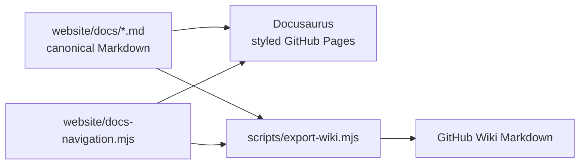

# Documentation publishing

Glyphora maintains one documentation source and publishes it in two forms:



| Destination | URL | Publisher |
|---|---|---|
| Styled guide and Scaladoc | <https://oleksandr-balyshyn.github.io/glyphora/> | `.github/workflows/docs.yml` |
| GitHub Wiki | <https://github.com/oleksandr-balyshyn/glyphora/wiki> | `.github/workflows/wiki.yml` |

Do not edit generated pages in the GitHub Wiki. Edit `website/docs`, update
`website/docs-navigation.mjs` when adding or removing a page, and push to `main`.

## Local preview

```bash
cd website
npm ci
npm run start
```

Build the production site and the Wiki export:

```bash
cd website && npm run build
cd ..
node scripts/export-wiki.mjs --output build/wiki
```

The exporter removes Docusaurus front matter, converts API links to absolute Pages
URLs, rewrites relative guide links to Wiki page names, and generates `Home.md`,
`_Sidebar.md`, and `_Footer.md`. It fails if a Markdown file is absent from the shared
navigation, preventing a page from silently disappearing from either destination.

## One-time GitHub setup

### GitHub Pages

In **Settings → Pages → Build and deployment**, set **Source** to **GitHub Actions**.

### GitHub Wiki

1. In **Settings → General → Features**, enable **Wikis**.
2. Create the first Wiki page once in the GitHub UI. This initializes the
   `glyphora.wiki.git` repository.
3. Create a classic personal access token with `public_repo` access (or `repo` if the
   repository is private) for an account allowed to edit this repository.
4. Add it as an Actions repository secret named `WIKI_TOKEN`.
5. Run the **Wiki** workflow manually, or push a documentation change to `main`.

GitHub deliberately scopes the workflow `GITHUB_TOKEN` to the source repository;
the separately cloned Wiki Git repository therefore uses the dedicated secret.
