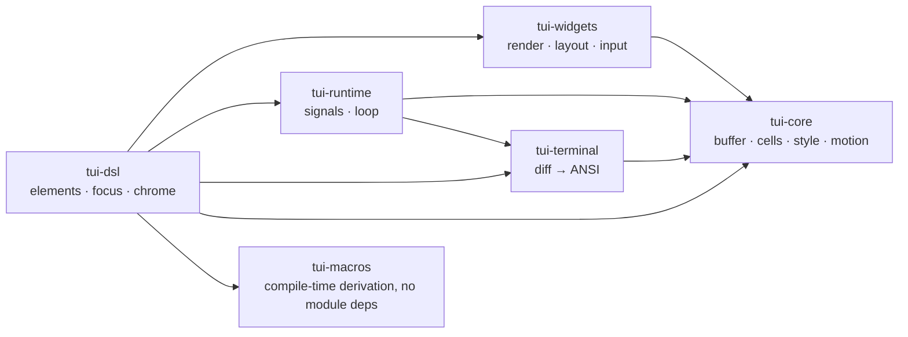

# Architecture

glyphora is a stack of small modules joined by one render pipeline. Applications can
use the complete DSL or stop at any lower tier; widgets never depend on a terminal,
and the terminal never knows about signals.

<p align="center">
  
</p>



Each arrow in the module graph is a real Mill dependency — nothing above `tui-core` reaches back
down into a layer above it, so you can also depend on any single tier directly (for
example, `tui-widgets` with a backend of your own, skipping the DSL entirely).

| Module | What it owns | API reference |
|---|---|---|
| `tui-core` | `Buffer`/`Cell`, `Style`, `Layout` solver, `Widget` traits, event ADT, `CharWidth` (UCD-generated width table), the motion values `Progress`/`Easing`/`Tween`/`Spring`/`Effect` | [tui-core](pathname:///api/core/) |
| `tui-terminal` | `Backend` trait, JLine 3 impl (diff flush, input decoding), `HeadlessBackend` | [tui-terminal](pathname:///api/terminal/) |
| `tui-widgets` | every built-in widget — backend-agnostic, render-to-`Buffer` tested | [tui-widgets](pathname:///api/widgets/) |
| `tui-runtime` | `Signal`/`Computed`, render thread, runner loop, tick clocks (`Stopwatch`/`Timer`) | [tui-runtime](pathname:///api/runtime/) |
| `tui-dsl` | `TuiApp`, `Element` tree, focus/mouse routing, chrome presets, screens/toasts/palette | [tui-dsl](pathname:///api/dsl/) |
| `tui-macros` | `deriveForm`/`FormFieldType` — compile-time only, keeps native-image reflect-config-free | [tui-macros](pathname:///api/macros/) |
| `tui-test` | `Pilot` driver, buffer assertions, golden frames — a test-only dependency (Scala package `io.worxbend.tui.testsupport`, repository directory `test-support/`) | — |

## tui-core

Foundational types, no dependencies, no terminal I/O, no reflection — the
maximum-stability tier everything else builds on:

- **Geometry**: `Rect`, `Position`, `Size`.
- **Frame buffer**: `Buffer` (mutable cell grid, absolute coordinates, silent
  clipping), `Cell` (a `String` symbol, because one cell can hold a multi-codepoint
  grapheme cluster).
- **Styling**: `Style`, `Color`, `Modifiers` (allocation-free bitset).
- **Text**: `Text` / `Line` / `Span`.
- **`CharWidth`**: terminal display-width arithmetic (CJK, combining marks, emoji ZWJ
  sequences, flags, variation selectors) — generated from the Unicode Character
  Database by `tools/generate-width-table.py`.
- **Layout**: `Constraint` (`Length`/`Percentage`/`Ratio`/`Min`/`Max`/`Fill`) and the
  `Layout.split` solver, plus `split2`…`split5`, which hand back a tuple so a
  statically known arity is destructured instead of indexed, and `splitWithSpacers`,
  which additionally returns the gap rectangles between and around the segments.
- **Widget traits**: `Widget`, `StatefulWidget[S]`. `Widget` has exactly one abstract
  method, `render(area: Rect, buffer: Buffer): Unit`, so Scala's SAM conversion means a
  **plain lambda is a complete widget** — there is no trait to implement, no base class,
  and nothing to register:

  ```scala
  import io.worxbend.tui.core.*

  val star: Widget = (area, buffer) =>
    if !area.isEmpty then buffer.set(area.x, area.y, Cell("*", Style.Default))
  ```

  That value goes straight into a view with `widget(star)`, or into another widget's
  `render` with `star.render(inner, buffer)`. `StatefulWidget[S]` is the same idea with
  the caller-owned state passed in: `(area, buffer, state) => …`. Everything a widget
  may do is in that signature — write cells inside `area`, and nothing else — which is
  what makes rendering testable without a terminal.
- **`Measured`**: the single contract for how much space a widget's content needs,
  `heightAt(width)` / `widthAt(height)`. Both return an `Option`: `None` means *this
  widget cannot say*, and a caller must treat that as unmeasurable rather than as a
  size. The DSL's measurement pass asks through this, so a widget that can measure
  itself needs no per-element wiring.
- **Input events**: `Event` / `KeyEvent` / `MouseEvent` ADT, defined here (not in
  `tui-terminal`) so widgets stay backend-agnostic.
- **Motion**: `Progress` (the one answer to *where is this animation at `elapsed`* —
  a one-shot fraction, or a whole position in a repeating cycle), `Easing`, `Tween`,
  `Spring`, and `Effect`, the post-render frame transform. All pure functions of a
  time they are handed: they hold no clock, own no thread, and touch no terminal,
  which is why they live down here where `tui-widgets` and `tui-runtime` can both
  reach them. See [Motion](./motion).

```scala
import io.worxbend.tui.core.*

val buffer = Buffer(Rect(0, 0, 20, 3))
// split2/split3/split4/split5 destructure a known arity into a tuple; `split` returns a Seq
val (titleArea, body) = Layout.vertical(1, Constraint.fill).split2(buffer.area)
buffer.setString(titleArea.x, titleArea.y, "Title", Style.Default.bold.withFg(Color.Cyan))
buffer.setString(body.x, body.y, "Body", Style.Default)

// blank a rectangle in one style — this is how an overlay stops the content underneath
// showing through, instead of hand-writing a loop per widget
buffer.fill(body, Cell(" ", Style.Default.withBg(Color.Black)))
// Buffer.filled(area, cell) is the same thing as a constructor, for a layer that starts opaque

// patch the style of a rectangle without knowing which symbols are in it — a selection
// highlight, a focus tint, a disabled overlay. setStyle replaces it, mapStyle derives it
// from whatever each cell already had
buffer.setStyle(titleArea, Style.Default.reverse)
buffer.mapStyle(body)(_.dim)
```

A widget laying a row out as a run of segments passes a column budget as a fifth
argument. `setString(x, y, text, style, maxWidth)` stops at whichever comes first, the
budget or the area's right edge, and answers how many columns it actually wrote — so
the next segment starts at `x + answer` with no second measurement of the text:

```scala
var column = row.x
Seq("Name", " · ", "Value").foreach { segment =>
  column += buffer.setString(column, row.y, segment, Style.Default, row.right - column)
}
```

The answer can be one less than the budget: a two-column grapheme that would only half
fit is dropped whole rather than split, because a terminal handed half of one draws it
across the column beyond the budget.

Text that carries styling of its own is a `Line` — a sequence of `Span`s, each with its
own `Style` — and `setLine(x, y, line, maxWidth, baseStyle)` writes one, sharing a single
column budget across the spans and answering the columns written, exactly as `setString`
does. Each span's style is layered over `baseStyle`, so the base supplies whatever a span
says nothing about; `setSpan` is the same for one span alone.

```scala
val status = Line(Seq(Span("ready", Style.Default.withFg(Color.Green)), Span(" · 3 replicas", Style.Default)))
val used   = buffer.setLine(row.x, row.y, status, row.width, Style.Default.withBg(Color.Black))
```

The line is written where it is told and nowhere else: centring or right-aligning it
inside a wider area is a layout decision, made by the widget drawing it through
`Alignment`, not by the buffer.

## tui-terminal

The terminal backend layer. Everything above (`tui-runtime`, widgets, DSL) talks to
`Backend` only:

- **`Backend`** — raw mode, alternate screen, cursor visibility, mouse capture,
  diff-based `draw(buffer)`, `readEvent(timeout)`. All fallible operations return
  `Either[BackendError, A]`. A second group of operations is optional: `setTitle`
  (the window or tab title), `clearRegion(ClearType)` (erase the whole display, or
  only from the cursor down, or only the current line — what an app that does not own
  the whole screen needs), `requestFullRedraw()` (throw away the diff baseline, so the
  next frame repaints every cell — the recovery path when something other than this
  app wrote to the terminal), `copyToClipboard`, `suspend`, `printAbove` and
  `insertBefore(height, widget)` (the same durable scrollback output, drawn by a widget
  so that it keeps its styling). Each has
  a default body that succeeds and does nothing, so a backend can implement as much or
  as little of it as its device supports.
- **`Backend`** — raw mode, alternate screen, cursor visibility **and position**,
  mouse capture, diff-based `draw(buffer)`, `readEvent(timeout)`. All fallible
  operations return `Either[BackendError, A]`.
  `setCursorPosition(position)` parks the terminal's *own* caret on a cell. That
  caret is not the highlighted block a text widget paints: it is the one an input
  method editor (the software that turns keystrokes into a Chinese, Japanese or
  Korean character) anchors its candidate popup to, and the one a screen reader
  reports as the insertion point. Position and visibility are separate calls, so a
  repaint can move the caret without flashing it. Call it *after* `draw` — a frame
  flush is a stream of cursor moves and would walk away from a caret parked before
  it.
  `appendLines(n)` scrolls the screen up by `n` rows, pushing the top rows into the
  terminal's scrollback and leaving `n` blank rows at the bottom. It is the primitive
  an *inline* viewport is built from — a UI that lives below the shell prompt on the
  primary screen instead of taking over the terminal — and it is meaningless on the
  alternate screen, which has no scrollback.
  Both are defaulted no-ops on the trait, so a backend written before they existed
  still compiles.
- **`JLine3Backend`** — the production implementation over `org.jline:jline-terminal`
  and `org.jline:jline-terminal-jni` 3.30.x, pinned. Those two rather than the
  `org.jline:jline` bundle: this layer uses four JLine types and never asks JLine to
  read a line, so the bundle's line reader, SSH server and telnet server are dead
  weight in every downstream POM and every native image.
  Keeps a snapshot of the last flushed frame and writes only changed cells,
  batched into one ANSI string per frame, with OSC 8 hyperlink transitions.
- **`InputDecoder`** — ANSI/CSI/SS3/SGR-mouse decoder, including the DECKPAM
  application keypad (`ESC O p`…`ESC O y` and friends, which is what the numeric
  keypad sends under tmux's `xterm-keys`), injected with a plain
  `read(timeoutMillis) => Int` function so it is fully unit-tested without a TTY.
  The two key vocabularies it decodes into — the kitty keyboard protocol's code
  points (`KittyKeys`) and the legacy `CSI n ~` numbers (`CsiKeys`) — are separate
  lookup tables, so they can be read against their specifications on their own.
- **`FrameEncoder`** — the pure buffer-diff-to-ANSI step `JLine3Backend.draw` uses.
  It takes the previous and the next frame and returns one string, so the
  cursor/style/hyperlink carry-over rules are unit-tested without a terminal.
  It is also the one place that decides when a frame cannot be described as a
  difference at all: `Buffer.diff` requires both frames to share an origin and a
  width, and after a resize — where the grid the old frame described no longer
  exists — the encoder calls `Buffer.emitAll` on the new frame to repaint every
  cell instead. Splitting the two apart matters because `diff` used to answer a
  shape mismatch by quietly repainting, which meant a caller who really had passed
  the wrong buffer got a full repaint on every frame rather than an error.

  `Buffer.diff` also takes an optional third argument, `clearEmojiTrailingCell`. A
  cluster containing U+FE0F — the variation selector that asks for a character's
  colourful emoji form, as in `❤️` — is two columns wide by the Unicode rules
  glyphora measures with, so the buffer reserves the column to its right and never
  repaints it on its own: drawing the glyph covers both halves. Terminals that draw
  such a sequence in a single column leave whatever an earlier frame put in that
  reserved column on screen beside the emoji. Setting the flag emits a blank into
  it, in the emoji's own style so a background fill stays continuous. It is off by
  default and belongs to a backend rather than to the buffer, because the opposite
  artifact is equally real: on a terminal that does draw both columns, that blank
  clips the glyph's right half.
- **`HeadlessBackend`** — in-memory backend for the `Pilot` end-to-end test harness.

The trait is deliberately JLine-free: a fake backend can implement it without
importing a single JLine type, and every example runs against `HeadlessBackend` in
tests and `JLine3Backend` live (JVM or native binary).

## tui-widgets

Every built-in widget. Depends only on `tui-core` — widgets are
backend-agnostic and render into a `Buffer`, nothing else. See the full
[Widget catalog](./widgets).

Animated widgets take an elapsed `FiniteDuration` rather than a frame counter, so a
frame is a pure function of its inputs: nothing is retained between renders, a test
can draw any moment directly, and an animation looks the same whatever tick rate the
app runs at. Sub-cell drawing — braille and half-block — goes through one shared bit
table (`SubCell`), used by both the `Canvas` painter and the shape spinners.

## tui-runtime

The mid-level framework tier:

- **`Signal[A]` / `Computed[A]` / `ReactiveScope`** — fine-grained signals. See
  [State & signals](./state-and-signals).
- **`RenderThread`** — single-render-thread contract: `checkRenderThread()` is a
  no-op when no runtime is running (so plain unit tests need no setup),
  `runOnRenderThread`, `runLater`. `Signal.set` asserts it.
- **`Runner` / `TerminalRunner` / `Frame` / `RunnerConfig`** — the event/render loop:
  terminal setup/teardown, diff-driven redraws, tick emission, resize handling.
- **`Stopwatch` / `Timer` / `TickDriven`** — caller-owned tick clocks, the thing
  that supplies the `elapsed` `tui-core`'s motion values are pure functions of.

### Frame numbers

Every `Frame` carries a `count`: how many frames this runner composed before it. The
first frame of a run is `0` and the number goes up by one per composed frame — a frame
whose contents the backend's diff turned into no output at all still used its number.
There are two sanctioned uses. Doing expensive work only occasionally:

```scala
if frame.count % 30 == 0 then refreshExpensivePanel()
```

and labelling a frame in a debug overlay:

```scala
frame.renderWidget(Paragraph(s"frame ${frame.count}"), debugArea)
```

It is deliberately *not* a clock. A frame rate depends on the terminal, so an animation
driven off `count` runs at one speed over SSH and another locally. Time-to-position
arithmetic has one owner, `core.Progress` (and the `Tween`/`Spring` values built on it),
which take a real elapsed duration — see [Motion](./motion).

`tui-dsl` adds `AnimationClock` on top of these: a signal of elapsed time republished
each tick, which the animated elements read. Because that read is tracked, a view
subscribes to the clock only while it actually renders an animation. The elapsed
*value* is measured from process start, so several runners in one JVM agree on what
time it is, but the `Signal` carrying it belongs to one render loop — a signal's
subscriber set is confined to a single render thread, so two runners sharing one
signal would race on it and silently lose subscriptions.

## tui-dsl

The high-level declarative API — what applications use day-to-day: `Element`,
`TuiApp`, the chrome presets (`scaffold`, `topBar`, `statusBar`, `sidebar`), themes,
screens, toasts, the command palette, and focus/mouse routing. See
[The app shell](./app-shell) and [Mouse & focus](./mouse).

## tui-macros

Compile-time codegen: everywhere the framework bridges *user-defined* code, the
bridge is generated at compile time — never runtime reflection. This is the
constraint that keeps GraalVM native-image builds free of reflect-config JSON.

- **`deriveForm[A]`** derives a `FormSpec[A]` from a case class via
  `Mirror.ProductOf` (`inline`, stdlib-only): field names become `FieldSpec`s, and each
  field's type contributes its control and its parser through the `FormFieldType`
  summoned for it. A field type with no instance in scope is a compile error.
- **`FormFieldType[A]`** is that per-type contribution — control plus parser.
  `String`/`Int`/`Double`/`Boolean` and `Option` of those ship with the module; a type
  of your own joins by declaring `given FormFieldType[YourType]` in its companion.
- **`Field[A]`** is cue4s-style lazily-composed parsing/validation:
  `Field.int("age").mapValidated(a => if a >= 18 then Right(a) else Left("must be 18+"))`.

CI enforces the zero-reflection rule with a grep over all main sources.

## House rules (CI-enforced)

- No `java.lang.reflect`/`Class.forName` anywhere outside `tui-macros`' compile-time
  codegen.
- No `String.length`/`substring` for layout math outside `CharWidth` — grapheme
  clusters and wide codepoints must always go through the Unicode-aware table.
- Warnings are errors (`-Wunused:all -Werror`).
- Scalafmt owns formatting; CI checks formatting, doesn't just apply it.
