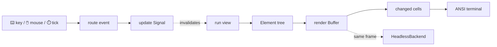

# Terminal UI, written like Scala

<p align="center">
  
</p>

glyphora is a Scala 3 toolkit for building terminal applications with **reactive
state, composable views, rich widgets, keyboard and mouse input, motion, and
GraalVM-native delivery**. It is small enough for a focused CLI companion and
structured enough for dashboards, forms, file browsers, and full-screen tools.

> **New here?** You can have a working counter on screen in about five minutes.
> Follow [Getting started](./getting-started), then return here when you want the
> mental model behind it.

## What it feels like

You model changing values with `Signal`, describe a view as an `Element` tree, and
let glyphora handle invalidation, layout, focus, terminal diffing, and cleanup:

```scala title="Counter.scala"
import io.worxbend.tui.dsl.*

object Counter extends TuiApp:
  private val count = Signal(0)

  def view(using ReactiveScope): Element =
    panel("Counter")(
      text(s"Count: ${count.get}").bold.color(Color.Cyan),
      text("+ increment · q quit").dim,
    ).rounded
      .onKey(Key.char('+')) { count.update(_ + 1) }
      .onKey(Key.char('q')) { quit() }

  def main(args: Array[String]): Unit =
    run().foreach(_ => ())
```

There is no separate template language. The view is ordinary typed Scala; state
reads are tracked while it runs, and key handlers update the same values directly on
the render thread.

## The mental model



The important pieces are:

1. **State** — `Signal[A]` stores mutable application state; `Computed[A]` derives
   cached values from it.
2. **View** — `view(using ReactiveScope)` reads state and returns an immutable
   `Element` description.
3. **Widgets** — elements measure and render backend-agnostic widgets into a
   two-dimensional `Buffer`.
4. **Runtime** — input, timers, redraws, effects, and the single render thread live
   in one predictable loop.
5. **Backend** — a real terminal receives minimal ANSI diffs; tests receive the same
   buffers through `HeadlessBackend`.

This separation is why a full app can be tested without opening a PTY, and why
widgets do not need to know anything about JLine, ANSI escape sequences, or signals.

## What you can build

| If you are building… | Start with | You will probably use |
|---|---|---|
| A focused interactive CLI | [Getting started](./getting-started) | `panel`, `input`, `Signal`, key handlers |
| A dashboard or monitor | [Widget catalog](./widgets) | gauges, sparklines, charts, `onTick` |
| A form or wizard | [Forms & validation](./forms-and-validation) | `deriveForm`, `FormState`, screens |
| A file or deployment tool | [The app shell](./app-shell) | sidebar, tabs, command palette, toasts |
| An app with HTTP or background work | [Async work & timers](./async-and-timers) | `RenderThread.runOnRenderThread`, loading widgets |
| A distributable executable | [Native binaries](./native-image) | GraalVM `native-image`, zero reflection |
| A custom widget library | [Architecture](./architecture) | `Widget`, `StatefulWidget`, `Buffer`, `CharWidth` |

## Why glyphora

- ⚡ **Reactive without ceremony** — a view subscribes to the signals it actually
  reads. Conditional branches drop subscriptions they no longer use.
- 🧩 **A real widget vocabulary** — inputs, tables, trees, markdown, forms, charts,
  loading states, menus, dialogs, and application chrome ship together.
- ⌨️ **Terminal interactions are first-class** — focus order, bubbling key events,
  mouse hit-testing, bracketed paste, and terminal resize events are part of the
  model.
- 🌍 **Unicode width is infrastructure** — grapheme clusters, emoji ZWJ sequences,
  flags, CJK, combining marks, wrapping, and cursor placement use generated Unicode
  data.
- 🎬 **Motion is composable** — effects transform a completed frame, keeping widget
  rendering deterministic and simple.
- 🧪 **Production and tests share a pipeline** — `Pilot` drives actual input/render
  cycles against a `HeadlessBackend`.
- 📦 **Native-image is a design constraint** — compile-time derivation replaces
  runtime reflection, so apps need no `reflect-config.json`.

## Pick your next step

- **I want a screen running now** → [Getting started](./getting-started)
- **I learn from complete code** → [Examples](./examples)
- **I have a specific UI problem** → [Cookbook](./cookbook)
- **I want to understand every layer** → [Architecture](./architecture)
- **Something is already broken** → [Troubleshooting](./troubleshooting)

The [Scaladoc API](pathname:///api/) is the exact-signature reference. This guide is
the task-oriented companion: it explains when to use those APIs and how the pieces
fit together.
