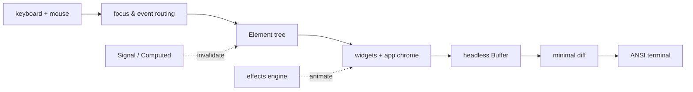

# glyphora

  

**Build expressive terminal UIs in Scala 3** — a signals-driven widget toolkit with app
chrome, animations, mouse support, and first-class GraalVM native-image binaries.

The same pipeline runs against a real terminal or a deterministic headless backend,
so full applications can be tested without a PTY.

## Why glyphora

- **Signals, not spaghetti** — state lives in `Signal`/`Computed`; whatever your view
  *reads*, re-renders when it changes. No dispatch loops, no dependency arrays.
- **40+ widgets** — from `Block` and `Gauge` to `DataTable`, `TextArea` (undo,
  cluster-safe editing), `DirectoryTree`, `Markdown`, braille `Chart`s, and a
  half-block `Image`.
- **App chrome built in** — `scaffold` with top bar / sidebar / status line, themes,
  key-binding registry, screens, toasts, and a fuzzy `Ctrl+P` command palette.
- **Motion** — a post-render effects engine (`fadeIn`, `coalesce`, `typewriter`, …)
  with easing and combinators, plus skippable splash screens.
- **Mouse-aware** — click to focus/activate, wheel to scroll, drag sliders and split
  panes.
- **Unicode-correct** — display width from the Unicode Character Database: CJK,
  emoji ZWJ families, flags, combining marks all measure right.
- **Native binaries** — every example compiles with `native-image --no-fallback` and
  **zero reflect-config**, starting in milliseconds.
- **Testable by design** — a headless backend + `Pilot` driver run full event/render
  cycles in plain unit tests.

Ready to try it? Head to [Getting started](./getting-started).
