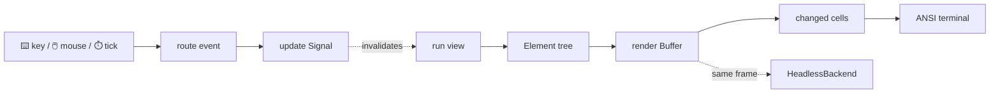

# Terminal UI, written like Scala

<p align="center">
  
</p>

glyphora is a Scala 3 toolkit for building terminal applications with **reactive
state, composable views, rich widgets, keyboard and mouse input, motion, and
GraalVM-native delivery**. It is small enough for a focused CLI companion and
structured enough for dashboards, forms, file browsers, and full-screen tools.

> **New here?** You can have a working counter on screen in about five minutes.
> Follow [Getting started](./getting-started), then return here when you want the
> mental model behind it.

:::caution Not on Maven Central yet

`0.13.0` is not tagged or published yet, so `io.worxbend::tui-dsl:0.13.0` will not resolve
from a public repository. Clone the repository and run `./mill __.publishLocal`, which
installs `tui-core`, `tui-terminal`, `tui-widgets`, `tui-runtime`, `tui-macros`,
`tui-dsl` and `tui-test` at `0.13.0` into `~/.ivy2/local`; Mill reads that cache by
default, and sbt needs `resolvers += Resolver.defaultLocal`. Full instructions are in
[Getting started](./getting-started#1-add-glyphora).

:::

## What it feels like

You model changing values with `Signal`, describe a view as an `Element` tree, and
let glyphora handle invalidation, layout, focus, terminal diffing, and cleanup:

```scala title="Counter.scala"
import io.worxbend.tui.dsl.*

class CounterApp extends TuiApp:
  private val count = Signal(0)

  def view(using ReactiveScope, Theme): Element =
    panel("Counter")(
      text(s"Count: ${count.get}").bold.fg(Color.Cyan),
      text("+ increment · q quit").dim,
    ).rounded
      .onKey(Key.char('+')) { count.update(_ + 1) }
      .onKey(Key.char('q')) { quit() }

object Counter extends CounterApp
```

`object Counter extends CounterApp` is already a runnable program — `TuiApp` supplies
the `main` method, so there is nothing else to write. There is no separate template
language. The view is ordinary typed Scala; state reads are tracked while it runs, and
key handlers update the same values directly on the render thread.

The app is written as a **class** with a one-line `object` on the end, rather than as a
single `object`, for one reason: a test needs a fresh app for every scenario. `TuiApp`
keeps its state — signals, the screen stack, running effects — on the instance and
never resets it between runs, so running one `object` twice starts the second run with
whatever the first run left behind. Writing it as a class lets a test say
`Pilot.start(Size(40, 10))(CounterApp().runWith)` once per test while the launcher
still gets its `object Counter`.

## The mental model


```mermaid
flowchart LR
  Event["⌨️ key / 🖱️ mouse / ⏱️ tick"] --> Route["route event"]
  Route --> Write["update Signal"]
  Write -. invalidates .-> View["run view"]
  View --> Tree["Element tree"]
  Tree --> Buffer["render Buffer"]
  Buffer --> Diff["changed cells"]
  Diff --> Terminal["ANSI terminal"]
  Buffer -. same frame .-> Test["HeadlessBackend"]
```

The important pieces are:

1. **State** — `Signal[A]` stores mutable application state; `Computed[A]` derives
   cached values from it.
2. **View** — `view(using ReactiveScope, Theme)` reads state and returns an immutable
   `Element` description. The `ReactiveScope` is what makes a `Signal` read subscribe
   the next redraw; the `Theme` is the app's own palette, handed in so that a helper
   called from the view is themed by the app rather than by the library default.
3. **Widgets** — elements measure and render backend-agnostic widgets into a
   two-dimensional `Buffer`.
4. **Runtime** — input, timers, redraws, effects, and the single render thread live
   in one predictable loop.
5. **Backend** — a real terminal receives minimal ANSI diffs; tests receive the same
   buffers through `HeadlessBackend`.

This separation is why a full app can be tested without opening a PTY, and why
widgets do not need to know anything about JLine, ANSI escape sequences, or signals.

## What you can build

| If you are building… | Start with | You will probably use |
|---|---|---|
| A focused interactive CLI | [Getting started](./getting-started) | `panel`, `input`, `Signal`, key handlers |
| A dashboard or monitor | [Widget catalog](./widgets) | gauges, sparklines, charts, `onTick` |
| A form or wizard | [Forms & validation](./forms-and-validation) | `deriveForm`, `FormState`, screens |
| A file or deployment tool | [The app shell](./app-shell) | sidebar, tabs, command palette, toasts |
| An app with HTTP or background work | [Async work & timers](./async-and-timers) | `Async.run` / `Async.runCatching`, loading widgets |
| A distributable executable | [Native binaries](./native-image) | GraalVM `native-image`, zero reflection |
| A custom widget library | [Architecture](./architecture) | `Widget`, `StatefulWidget`, `Buffer`, `CharWidth` |

## Why glyphora

Four things here work differently from the other terminal toolkits, and they are the
reason to pick this one.

**Key bindings are validated where you declare them, not where they fail to fire.**
Declaring a binding for `ctrl+i` does not give you a key that quietly never triggers.
It is rejected where you wrote it, with:

```text
'ctrl+i' is indistinguishable from Tab on terminals without the kitty keyboard protocol; bind "tab" instead
```

Ctrl+I *is* Tab on the wire, and a toolkit that accepts the spec is promising
something the terminal cannot deliver.

**One `binding(...)` declaration drives four features.** The same value that
dispatches the key also supplies the hint in `statusBar(bindings)`, the row in
`helpOverlay(bindings)`, and the entry in the fuzzy command palette (`Ctrl+P`). There
is no second list of keys to keep in step with the first — which is why the help
screen in a glyphora app does not go stale.

**Suspending the UI and printing above it are first-class services, not tricks.**
`suspend { … }` hands the terminal back — leaving the alternate screen and raw mode —
so an app can launch `$EDITOR` or a shell and then repaint; `printAbove("…")` writes
durable lines into the scrollback *above* the live UI, so they are still there after
the app exits.

**A widget is a function, so extending the library needs no ceremony.** `Widget` is a
SAM (single abstract method) type, which means a plain lambda is a widget:
`(area, buffer) => buffer.set(area.x, area.y, Cell("*", Style.Default))` is complete
and usable, with no trait to implement and nothing to register. See
[Architecture](./architecture).

And the qualities that make those pleasant to live with:

- ⚡ **Reactive without ceremony** — a view subscribes to the signals it actually
  reads. Conditional branches drop subscriptions they no longer use.
- 🧩 **A real widget vocabulary** — inputs, tables, trees, markdown, forms, charts,
  loading states, menus, dialogs, and application chrome ship together.
- ⌨️ **Terminal interactions are first-class** — focus order, bubbling key events,
  mouse hit-testing, bracketed paste, and terminal resize events are part of the
  model.
- 🌍 **Unicode width is infrastructure** — grapheme clusters, emoji ZWJ sequences,
  flags, CJK, combining marks, wrapping, and cursor placement use generated Unicode
  data.
- 🎬 **Motion is composable** — effects transform a completed frame, keeping widget
  rendering deterministic and simple.
- 🧪 **Production and tests share a pipeline** — `Pilot` drives actual input/render
  cycles against a `HeadlessBackend`.
- 📦 **Native-image is a design constraint** — compile-time derivation replaces
  runtime reflection, so apps need no `reflect-config.json`.

### Coming from ratatui?

The layout vocabulary is deliberately the same — `Constraint.Length` / `Percentage` /
`Fill` / `Min` / `Max`, solved the same way — so a ratatui layout transcribes almost
line for line. Two things are worth knowing before you start:

- `Flex.SpaceAround` and `Flex.SpaceEvenly` here have **CSS semantics**, and they
  really are different from each other: `SpaceAround` puts an equal amount of space
  *around* each segment, so the two outer edges get half a gap each, while
  `SpaceEvenly` makes every gap equal *including* both edges. Choose by which edges
  you want.
- Flex only bites when space is actually left over. A `Fill` or `Min` child absorbs
  the leftover greedily, and with one of those present every flex mode collapses to
  `Start`.

## Pick your next step

- **I want a screen running now** → [Getting started](./getting-started)
- **I learn from complete code** → [Examples](./examples)
- **I have a specific UI problem** → [Cookbook](./cookbook)
- **I want to understand every layer** → [Architecture](./architecture)
- **Something is already broken** → [Troubleshooting](./troubleshooting)

The [Scaladoc API](pathname:///api/) is the exact-signature reference. This guide is
the task-oriented companion: it explains when to use those APIs and how the pieces
fit together.
